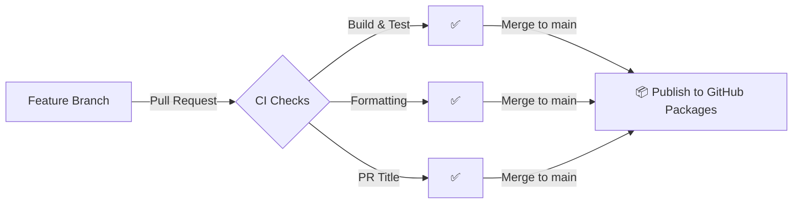

# Contributing

This repository follows trunk-based development. All changes go through pull requests to `main`.

## Contribution Checklist

- [ ] PR title follows [Conventional Commits](https://www.conventionalcommits.org/) (e.g., `feat: add new cache`, `fix: correct token refresh`)
- [ ] All tests pass
- [ ] Code formatting complies with `dotnet format`
- [ ] Package version bumped in `.csproj` if publishing a new release

## Version Bumping

Package versions are defined in `<VersionPrefix>` in each `.csproj`:

- `src/Equinor.ProCoSys.Auth/Equinor.ProCoSys.Auth.csproj`
- `src/Equinor.ProCoSys.BlobStorage/Equinor.ProCoSys.BlobStorage.csproj`
- `src/Equinor.ProCoSys.Common/Equinor.ProCoSys.Common.csproj`

> **Important:** Auth has a project reference to Common. When incrementing Common's version, also increment Auth's version — otherwise the previously published Auth package will continue to reference the old Common version.

## Publish Flow

